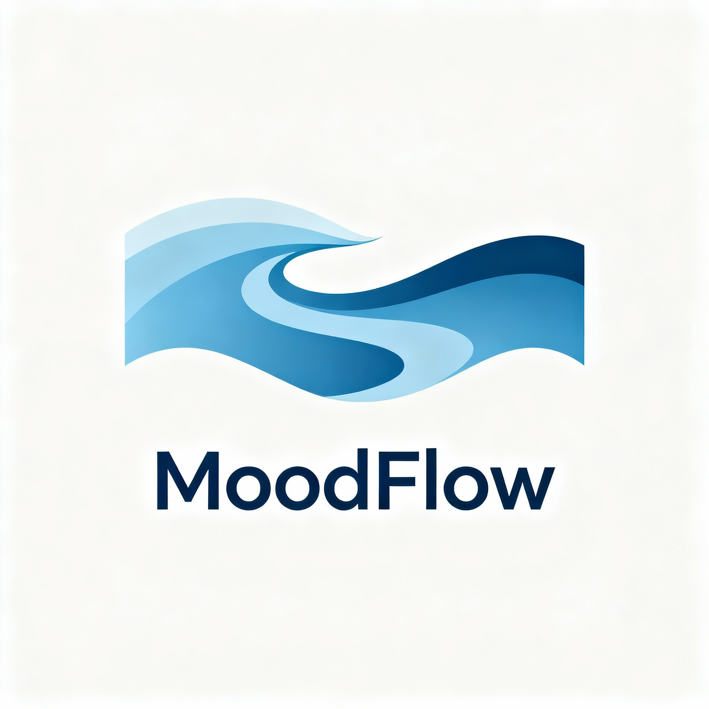

# MoodFlow - Corporate Wellness App

Une app de bien-être au travail. Vue 3 + TypeScript + Supabase.
Disponible en Web et Mobile (iOS/Android).



## Fonctionnalités

### Partage d'humeur
- Sélecteur d'humeur (5 niveaux)
- Posts anonymes ou identifiés
- Tags pour catégoriser
- Filtre par mood
- Filtre posts récents
- Réactions et réponses

### Chat anonyme
- Conversations privées
- Messages en temps réel
- Anonymat garanti

### Dashboard
- Stats pour les managers
- Visualisation des tendances
- Graphiques (Chart.js)

### Auth
- Login/Register
- OAuth Google et GitHub
- Soleil animé qui ferme les yeux pendant la saisie du mot de passe
- Rôles (Employee/Manager)

### Mobile
- App iOS et Android (Capacitor)
- Retour haptique
- Clavier natif
- Status bar custom
- Safe areas pour encoche

## Technologies

### Frontend
- Vue 3 (Composition API)
- TypeScript
- Tailwind CSS
- Vite

### Backend
- Supabase (PostgreSQL + Auth + Realtime)
- Row Level Security
- Migrations SQL

### Design
- Design system maison : tokens Tailwind, polices auto-hébergées (Bricolage Grotesque, Instrument Serif, Instrument Sans, DM Mono)
- GSAP + ScrollTrigger + Lenis : défilement doux, titres révélés ligne par ligne, cartes empilées, bandeaux défilants
- Soleil de la marque et visages d'humeur en SVG animés
- Respect de `prefers-reduced-motion`

### Mobile
- Capacitor 7.x (iOS et Android)
- Plugins natifs

## Installation

### Prérequis
- Node.js 18+
- npm ou yarn

### Installation web

```bash
# Cloner le repo
git clone [repo-url]
cd MoodFlow-Corporate-Wellness

# Installer les dépendances
npm install

# Lancer le serveur de dev
npm run dev
```

### Installation mobile

```bash
# Build le projet
npm run build

# Synchroniser avec les plateformes natives
npm run cap:sync

# Ouvrir Android Studio
npm run cap:android

# Ouvrir Xcode (Mac uniquement)
npm run cap:ios
```

Pour plus de détails, consultez [MOBILE_SETUP.md](MOBILE_SETUP.md).

## ⚙️ Configuration

### Variables d'environnement

Créez un fichier `.env` à la racine :

```env
VITE_SUPABASE_URL=votre_url_supabase
VITE_SUPABASE_ANON_KEY=votre_cle_anon
```

### Base de données Supabase

1. Créer un projet sur [supabase.com](https://supabase.com)
2. Exécuter les migrations dans l'ordre :
   ```bash
   supabase/migrations/20251015140227_create_initial_schema.sql
   supabase/migrations/20251015140300_add_missing_tables.sql
   supabase/migrations/20251015140400_fix_missing_tables_safe.sql
   ```

## 📜 Scripts disponibles

### Développement web
```bash
npm run dev          # Serveur de développement
npm run build        # Build de production
npm run preview      # Preview du build
npm run typecheck    # Vérification TypeScript
```

### Mobile
```bash
npm run cap:sync         # Build + sync toutes plateformes
npm run cap:android      # Ouvrir dans Android Studio
npm run cap:ios          # Ouvrir dans Xcode
npm run cap:run:android  # Build + lancer sur Android
npm run cap:run:ios      # Build + lancer sur iOS
npm run cap:copy         # Copier web assets vers native
```

## App Mobile

### Android
- **API Level minimum** : 21 (Android 5.0)
- **Target SDK** : 34
- **App ID** : `com.moodflow.app`

### iOS
- **iOS minimum** : 13.0
- **Bundle ID** : `com.moodflow.app`
- **Nécessite Xcode 14+**

## Personnalisation

### Thème et couleurs

La palette vient du logo (soleil jaune, MOOD violet, FLOW rouge) et des fonds des vidéos. Elle est définie dans `tailwind.config.js` :

```javascript
colors: {
  ink: '#1A0E2B',      // texte
  paper: '#FFF8EF',    // fond
  sun: '#FED94E',
  coral: '#FA4D52',
  grape: '#8248FE',
  tangerine, flame, candy, lilac, aqua, blush,
  mood: {...}          // une couleur par humeur
}
```

Les couleurs et les visages des humeurs sont centralisés dans `src/lib/moods.ts`, les animations dans `src/lib/motion.ts` et `src/directives/motion.ts` (`v-reveal`, `v-split`, `v-magnetic`, `v-parallax`).

## Documentation

- [MOBILE_SETUP.md](MOBILE_SETUP.md) - Guide complet mobile
- [CHANGELOG_MOBILE.md](CHANGELOG_MOBILE.md) - Changements Mobile

## Structure du projet

```
MoodFlow-Corporate-Wellness/
├── src/
│   ├── assets/           # Images et ressources
│   │   └── mood_flow_logo.png
│   ├── components/       # Composants Vue
│   │   ├── AppLayout.vue
│   │   ├── SplashScreen.vue
│   │   └── ...
│   ├── composables/      # Composables réutilisables
│   │   └── useNative.ts     # Fonctionnalités natives
│   ├── directives/       # Directives d'animation (v-reveal, v-split…)
│   ├── lib/              # Utilitaires
│   │   ├── auth.ts
│   │   ├── supabase.ts
│   │   └── database.types.ts
│   ├── router/           # Configuration Vue Router
│   ├── views/            # Pages de l'app
│   │   ├── LoginView.vue
│   │   ├── RegisterView.vue
│   │   ├── FeedView.vue
│   │   ├── ChatView.vue
│   │   ├── DashboardView.vue
│   │   └── ProfileView.vue
│   ├── App.vue           # Composant racine
│   ├── main.ts           # Point d'entrée
│   └── style.css         # Styles globaux
├── android/              # Projet Android natif
├── ios/                  # Projet iOS natif
├── supabase/             # Migrations SQL
├── capacitor.config.ts   # Config Capacitor
├── tailwind.config.js    # Config Tailwind
└── vite.config.ts        # Config Vite
```

## Dépannage

### Problème : Build mobile échoue
- Vérifier les prérequis (Android Studio/Xcode)
- Nettoyer et rebuilder : `npm run build && npm run cap:sync`

### Problème : Erreur Supabase
- Vérifier les variables d'environnement `.env`
- S'assurer que les migrations sont appliquées
- Vérifier les RLS policies dans Supabase

## Contribution

Les contributions sont les bienvenues ! N'hésitez pas à ouvrir des issues ou pull requests.

## 📄 Licence

MIT License - Voir le fichier LICENSE pour plus de détails.

---

**Version** : 2.0  
**Dernière mise à jour** : 22 Octobre 2025  

Codé par Abdoul, Mathieu, Amaury, Jerobel et Mehmet
